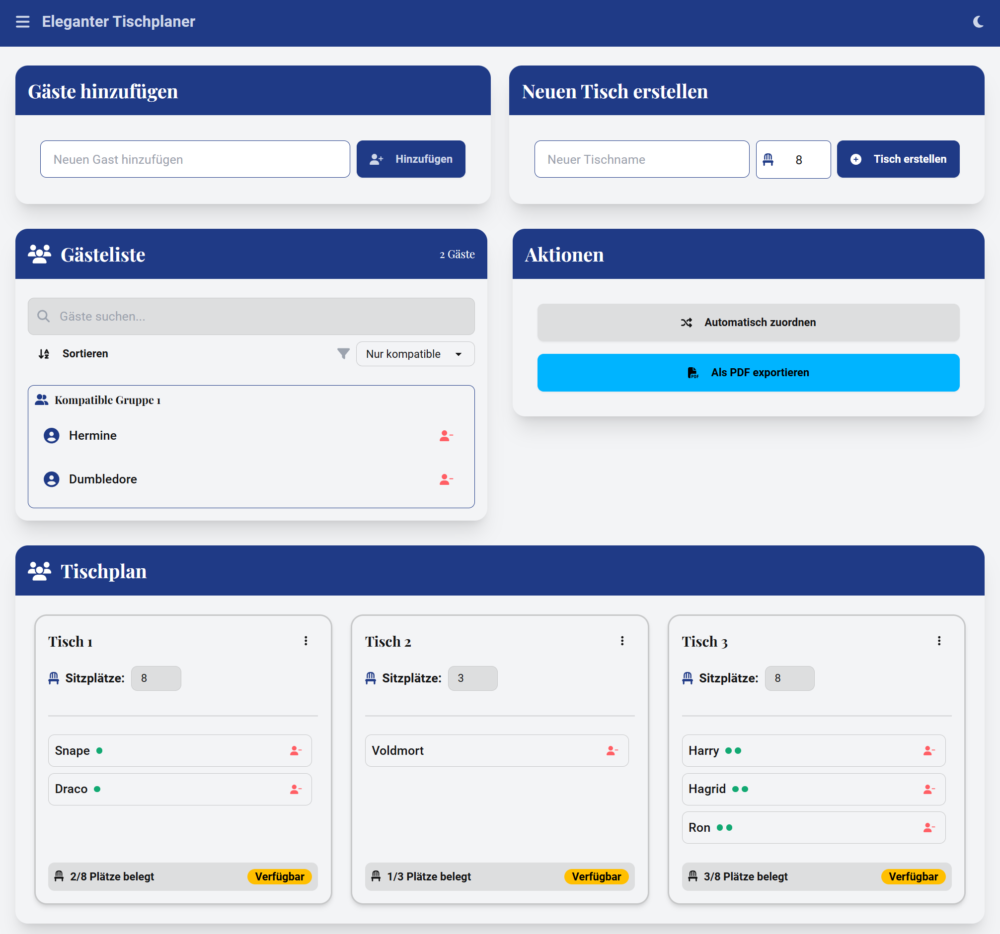

# Eleganter Hochzeit Tischplaner

Ein interaktiver und eleganter Tischplaner für Hochzeiten, erstellt mit React. Mit dieser Anwendung können Sie Gäste hinzufügen, ihre Kompatibilität untereinander festlegen und sie den Tischen zuweisen. Die Anwendung bietet ein modernes, benutzerfreundliches Interface mit Drag-and-Drop-Funktionalität und Dunkel-/Hellmodus.

## Features

- Gäste hinzufügen und entfernen
- Kompatibilität zwischen Gästen festlegen
- Tische hinzufügen, bearbeiten und entfernen
- Gäste per Drag-and-Drop den Tischen zuweisen
- Verbleibende Gäste automatisch den Tischen zuweisen
- Export der Tischbelegung als PDF
- Responsives Design für Desktop und mobile Geräte
- Dunkel-/Hellmodus für verbesserte Benutzerfreundlichkeit
- Fortschrittsanzeige für die Sitzplatzverteilung

## Screenshot



## Installation

1. Klone das Repository:
    ```sh
    git clone https://github.com/storminator89/weddingplanner.git
    ```
2. Wechsel in das Projektverzeichnis:
    ```sh
    cd weddingplanner
    ```
3. Installiere die Abhängigkeiten:
    ```sh
    npm install
    ```

## Nutzung

1. Starte die Anwendung:
    ```sh
    npm start
    ```
2. Öffne deinen Browser und gehe zu `http://localhost:3000`.

## Aufbau

- **`src/App.js`**: Hauptkomponente der Anwendung
- **`src/GuestList.js`**: Komponente für die Gästeliste
- **`src/TableList.js`**: Komponente für die Tischliste
- **`src/WarningPopup.js`**: Komponente für Warnmeldungen
- **`src/ProgressBar.js`**: Komponente für die Fortschrittsanzeige
- **`src/helpers.js`**: Hilfsfunktionen für verschiedene Operationen
- **`src/index.css`**: Globales Stylesheet für die Anwendung

## Technologien

- React
- react-beautiful-dnd für Drag-and-Drop-Funktionalität
- Tailwind CSS für Styling
- FontAwesome für Icons
- jsPDF für PDF-Export

## Mitwirken

Beiträge sind willkommen! Bitte eröffne ein Issue, um ein neues Feature vorzuschlagen oder einen Fehler zu melden.


